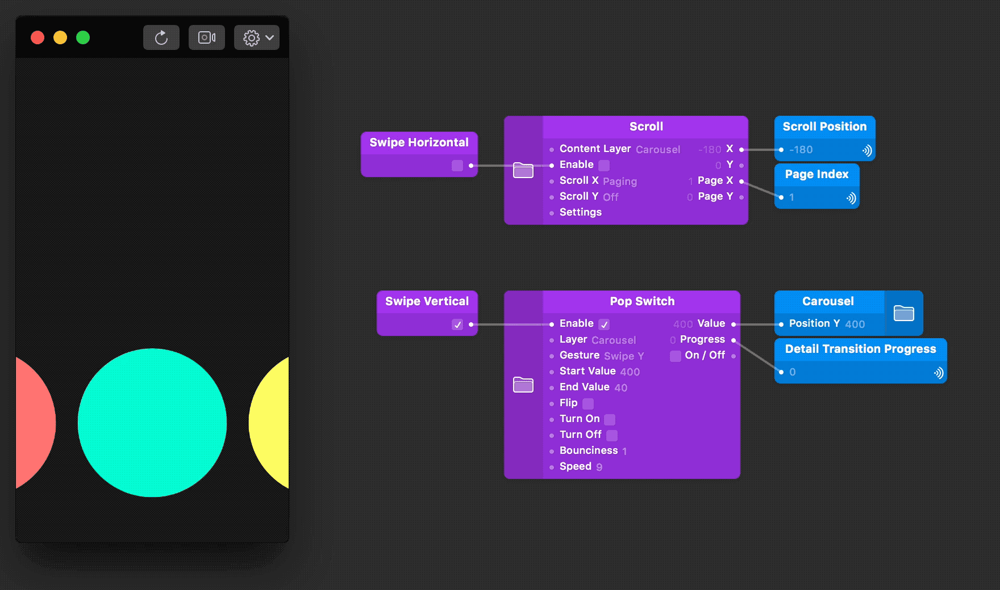

# Bidirectional Swipe in Origami Studio

This example uses Swipe Horizontal and Swipe Vertical patches to coordinate separate swipe gestures on a carousel. You can get the patches with the [passi.design Origami System](https://github.com/epassi/origami-passi-design-system).

